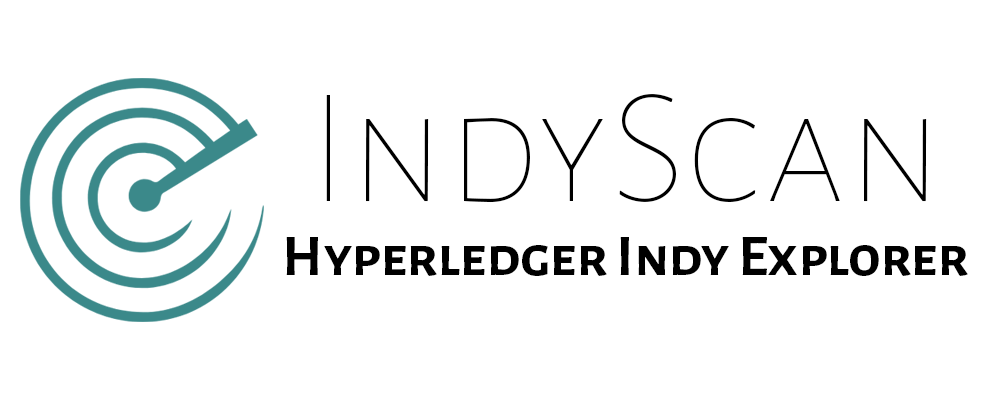
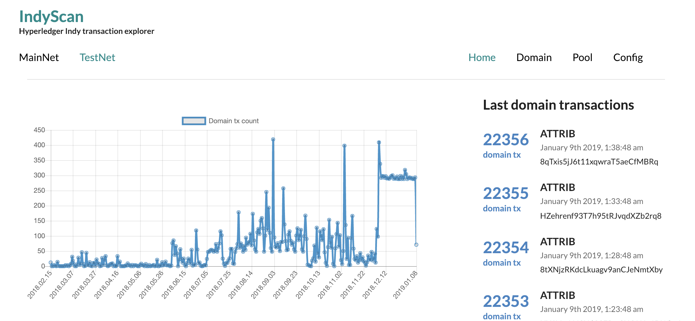

# Indyscan
## Hyperledger Indy Transaction Explorer


- IndyScan is transaction explorer for Hyperledger Indy blockchain.
- IndyScan for Sovrin public blockchain is deployed @ [https://indyscan.io](https://indyscan.io).



# How it works?
- The `indyscan-daemon` checks ledger for new transactions.
- Transactions are stored in Elasticsearch ([storage format info](./indyscan-storage/readme.md))
- `indyscan-webapp` is web UI to browse and explore transaction data.
- `indyscan-api` provides HTTP API to query transaction data.

# Start locally in localhost
The easiest way to get started with indy. Follow [this](start) to startup locally Indypool with Indyscan
attached out of the box.  

# Start in AWS
Second option is running in AWS. Follow [this](start-aws) to startup Indypool with Indyscan
attached out of the box in AWS.

# Custom deployments or running on host
If
- you want to run Indyscan on your host machine
- you want to run Indyscan against some particular Indy network
- you want to deploy Indyscan on intranet
you will find useful more info about the individual services you need and how to configure them.
Before you dig in, try to dig into docker configuration provided [here](start) for running on localhost 
 you might just figure small modification you need to do for your use case. 

## Structure
```
- start/               - automation to start scanned Indypool locally
- start-aws/           - automation to start scanned Indypool in AWS
- indyscan-api/        - indyscan API for querying db-stored transactions
- indyscan-api-client/ - http client to call indyscan api
- indyscan-webapp/     - nextjs based UI running against indyscan-api 
- indyscan-daemon/     - process searching for ledger transactions, storing them in a database
- indyscan-daemon-ui/  - user interface to manage indyscan-daemon workers 
- indyscan-storage/    - shared library for app and daemon - how to store and retrieve transactions in db
- indyscan-txtype/     - shared library contaning domain knowledge about indy transactions
- ubuntu-libindy/      - base docker image for daemon docker image
- indypool-client/     - small tool for verifying connectivity to an indy ledger
- dev/                 - scripts for managing this monorepo
```

## Indyscan daemon
Scans ledger and stores the found transactions in database. [Read more](indyscan-daemon).

## Indyscan api
Provides HTTP api to query transactions (found by the daemon) and networks from the database [Read more](indyscan-api).

## Indyscan api-client
Provides Javascript client for talking to Indyscan API [Read more](indyscan-api-client).

## Indyscan web-app
NEXT.JS based UI for viewing scanned transactions [Read more](indyscan-webapp).
